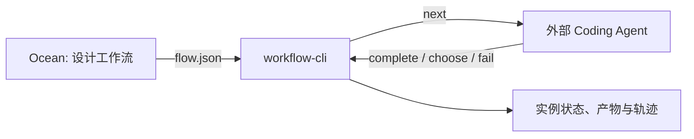

# workflow-cli

> 让 Coding Agent 按确定的工作流推进，而不是凭上下文记忆决定下一步。

`workflow-cli` 是一个面向外部 Coding Agent 的确定性工作流 Harness。它消费 Ocean 在设计阶段产出的 `flow.json`，将工作流图变成一个可持久化、可恢复、可审计的 CLI 协议。

CLI 不调用模型，也不执行节点任务。Agent 负责当前节点内的理解、推理和实际工作；CLI 负责节点顺序、状态迁移、分支、重试、环回、产物和执行历史。

```text
CLI 管流程。Agent 管工作。
```

## 为什么使用

Coding Agent 很擅长完成单个任务，但不应依赖它自己的短期上下文来管理长流程。任务一旦包含调研、方案、审核、返工和多次重入，Agent 很容易跳步、忘记已完成内容，或在失败后沿错误路径反复尝试。

`workflow-cli` 将流程控制从 Agent 的记忆中移出：

- **确定性路由**：`flow.json` 决定下一节点，Agent 不需要自行猜测路线。
- **显式交接**：每个已完成节点都必须提交非空产物；每个决策节点都必须显式选择分支。
- **可恢复状态**：状态、产物、上下文和轨迹写入实例目录，中断后可读取时间线恢复。
- **受限重入**：步数、环回和失败重试都有独立上限，超限后中止实例。
- **可审计历史**：同一节点每次重入都有独立执行 ID 和产物目录，可查询和对比。

## 快速开始

### 从源码构建

```bash
cargo build --release
```

二进制文件生成在 `target/release/workflow`。以下示例使用当前仓库附带的工作流：

```bash
BIN=./target/release/workflow

# 查看可用工作流。
"$BIN" list

# 创建一次执行实例，并保存返回的 instance-id。
INSTANCE_ID=$("$BIN" instance task-standard-pipeline --input "实现登录功能")

# 取得当前允许处理的节点内容。
"$BIN" next --instance "$INSTANCE_ID"

# 外部 Agent 此时执行 next 返回的任务。

# 节点完成后，提交非空产物并推进。
"$BIN" complete --instance "$INSTANCE_ID" --output "已完成任务理解，关键约束为……"

# 继续取得下一节点。
"$BIN" next --instance "$INSTANCE_ID"

# 随时查看持久化状态。
"$BIN" status --instance "$INSTANCE_ID"
```

当 `next` 返回 decision 节点时，Agent 必须选择一个已有分支：

```bash
"$BIN" choose --instance "$INSTANCE_ID" --branch "没问题" --reason "审核证据充分"
```

当 business 或 process 节点无法完成时，记录失败后再重新取得该节点：

```bash
"$BIN" fail --instance "$INSTANCE_ID" --reason "缺少可验证的输入"
"$BIN" next --instance "$INSTANCE_ID"
```

## 工作方式



Ocean 与 `workflow-cli` 分属不同阶段：

| 阶段 | 组件 | 职责 |
|---|---|---|
| 设计时 | Ocean | 绘制工作流，并产出 `meta-data/flow.json`。 |
| 运行时 | `workflow-cli` | 读取工作流图，控制实例状态与合法转换。 |
| 执行时 | 外部 Coding Agent | 执行当前节点的调研、编码、测试、审核或决策。 |

运行循环如下：

```text
创建实例
  -> next：CLI 交付当前唯一允许处理的节点
  -> Agent 在 CLI 外部执行该节点
  -> complete / choose / fail：Agent 提交一个合法结果
  -> CLI 写入状态并准备下一节点
  -> 重复，直到工作流完成或中止
```

## 核心概念

### 工作流

一个工作流是 `.workflows/<workflow-name>/meta-data/flow.json` 中定义的图。`workflow-cli` 不修改该图，运行时路由只以它为准。

```text
<project-root>/
├── .workflows/
│   └── <workflow-name>/
│       ├── meta-data/
│       │   └── flow.json
│       └── WORKFLOW.md                 # 可选；创建实例时复制为快照
└── .nodes/
    └── <node-task>.md                  # business 节点引用的任务内容
```

`WORKFLOW.md` 是工作流说明和实例快照来源，不参与运行时路由。`nodeRefPath` 相对于项目根目录解析，例如 `.nodes/investigate.md` 会读取 `<project-root>/.nodes/investigate.md`。

### 节点

| 类型 | `next` 返回什么 | 如何离开节点 |
|---|---|---|
| `start` | 不交给 Agent。 | 创建实例时沿唯一出边进入首个节点。 |
| `business` | `data.nodeRefPath` 指向的 Markdown 正文。 | Agent 调用 `complete` 或 `fail`。 |
| `process` | `data.content` 中的内嵌任务文本。 | Agent 调用 `complete` 或 `fail`。 |
| `decision` | 判断条件和可选分支。 | Agent 调用 `choose`。 |
| `end` | 不交给 Agent。 | 下一次 `next` 将实例标记为完成。 |

普通节点必须恰好有一条出边；否则 CLI 会拒绝推进。decision 节点通过分支的 `branchId` 决定目标边。

### 实例

一次 `workflow instance <workflow-name>` 会创建一个独立实例。实例拥有自己的当前节点、状态、限制、产物、上下文和轨迹，多个实例彼此隔离。

```text
.workflows/<workflow-name>/instance/<instance-id>/
├── instance.md                         # 可选 WORKFLOW.md 快照
├── process.md                          # 状态、执行路径和执行轨迹表
├── artifacts/
│   └── <node-name>/<invoke-id>/
│       ├── detail.md                   # complete 或 choose 的产物
│       └── error.md                    # fail 的原因
├── context.md                          # 可选的暂存上下文
└── trace/trace.jsonl                   # 追加式命令与转换轨迹
```

每次交给 Agent 的 business、process 或 decision 节点进入都会获得唯一的 `invoke-<timestamp>-<millisecond>` ID。同一节点因返工或环回而再次进入时会写入新的目录，因此历史产物不会被覆盖。

## 状态与约束

每个实例处于以下状态之一：

| 状态 | 含义 | 唯一允许的流程命令 |
|---|---|---|
| `idle` | 当前节点尚未交给 Agent。 | `next` |
| `executing` | business/process 节点已交给 Agent。 | `complete` 或 `fail` |
| `awaiting_choice` | decision 节点已交给 Agent。 | `choose` |
| `completed` | 已到达 end 节点。 | 无 |
| `aborted` | 已超出配置限制。 | 无 |

CLI 强制以下规则：

1. 不在 `idle` 状态时，`next` 会被拒绝。
2. `complete` 只接受 `executing` 状态且非空的产物。
3. `choose` 只接受当前 decision 节点声明过的分支名称。
4. 在交付新节点之前，`next` 会确认上一 business/process 节点已有非空 `detail.md`。
5. `fail` 不会自动执行业务重试；它只记录错误并重新开放当前节点给外部 Agent。

创建实例时可配置限制：

```bash
workflow instance <workflow-name> \
  --max-steps 100 \
  --max-loop 10 \
  --max-retry 2
```

| 限制 | 默认值 | 作用 |
|---|---:|---|
| `max_steps` | 100 | 限制交给 Agent 的节点进入次数。 |
| `max_loop` | 10 | 限制 decision 分支回到已完成节点的次数。 |
| `max_retry` | 2 | 限制当前节点连续失败的次数。 |

任一限制超出后，实例变为 `aborted`。

## 命令参考

所有命令都支持 `--root <path>`。省略时，CLI 从当前目录向上查找第一个包含 `.workflows/` 的目录。使用 `workflow --help` 或 `workflow <command> --help` 获取参数的完整说明。

### 发现与实例

| 命令 | 说明 |
|---|---|
| `workflow list` | 列出包含 `meta-data/flow.json` 的工作流。 |
| `workflow instance <workflow-name>` | 创建实例并输出 instance-id。支持 `--input`、`--instance` 和三类限制参数。 |
| `workflow instance list [--workflow <name>]` | 列出已有实例及其持久化状态。 |

### 推进流程

| 命令 | 说明 |
|---|---|
| `workflow next --instance <id> [--json]` | 对 business/process/decision 节点返回当前任务或决策信息，并转为 `executing` 或 `awaiting_choice`；遇到 end 节点时将实例标记为完成。 |
| `workflow complete --instance <id> [--output <text> \| --output-file <path>]` | 写入非空产物并按图推进。未指定输出参数时从 stdin 读取。 |
| `workflow choose --instance <id> --branch <name> [--reason <text>]` | 记录决策并沿选定分支推进。 |
| `workflow fail --instance <id> --reason <text>` | 写入失败原因，并在未超限时允许当前节点重新进入。 |
| `workflow status --instance <id> [--json]` | 输出当前节点、状态、步数、环回和重试计数。 |

### 查看产物与恢复上下文

| 命令 | 说明 |
|---|---|
| `workflow artifact list --instance <id> [--json]` | 按执行轨迹列出节点、执行 ID、状态和产物类型。 |
| `workflow artifact view --instance <id> (--node <name> \| --invoke <id>) [--json]` | 查看保存的产物；按节点查询时返回全部重入记录。 |
| `workflow artifact search --instance <id> --keyword <text> [--json]` | 在保存的 detail/error 内容中做字面子串搜索。 |
| `workflow artifact timeline --instance <id> [--json]` | 汇总初始输入、暂存上下文、执行轨迹和全部产物，用于恢复 Agent 上下文。 |
| `workflow artifact diff --instance <id> --node <name> [--context <n> \| --full] [--json]` | 对同一节点相邻两次执行的产物做逐行 diff。 |

### 暂存上下文

| 命令 | 说明 |
|---|---|
| `workflow context set --instance <id> --topic <text> --content <text>` | 向实例的 `context.md` 追加带时间戳的上下文，不推进流程。 |
| `workflow context get --instance <id> [--json]` | 读取暂存上下文。 |

`status`、所有 `artifact` 子命令和两个 `context` 子命令都会尝试记录命令审计信息到 `trace/trace.jsonl`。查询命令不改变工作流状态；`context set` 会按设计追加 `context.md`。

## JSON 输出

适合被其他程序或上层 Harness 消费的命令支持 `--json`：

- `next`：当前节点类型、名称、执行 ID，以及任务内容或可选分支；
- `status`：持久化状态；
- `artifact`：产物元数据、内容、时间线或 diff；
- `context get`：暂存上下文。

## 边界

`workflow-cli` 是流程控制层，不是通用 Agent 平台。它有意不做以下事情：

- 不调用 Ocean，也不编辑 `flow.json`；
- 不创建或调用 LLM/Agent 会话；
- 不执行节点中的搜索、编码、测试或审核任务；
- 不运行 shell、代码搜索、测试或代码审查；
- 不验证 Agent 产物是否真实、完整或正确；
- 不限制 Agent 在操作系统层面可用的工具；
- 不提供 worker、队列、定时器、分布式调度或自动业务重试。

如果需要的是自动调用模型、调度后台任务或验证代码结果，应由外部 Agent Harness、CI 或其他执行系统承担；`workflow-cli` 只提供确定性的流程控制和持久化记录。

## 开发

```bash
cargo test
cargo build --release
```

## 许可证

[MIT License](LICENSE)